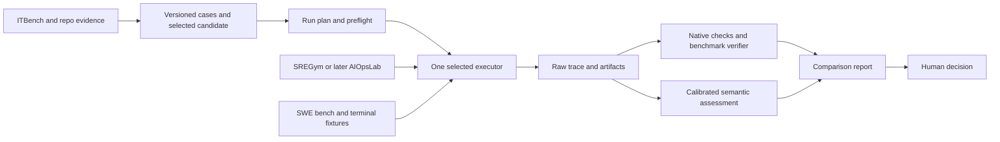

# Evaluation architecture

The architecture reuses the native fleet runner as the reference for host behavior. Adapters add
benchmarks and reporting without making every tool an execution framework. All proposed runtime
behavior in this document is [unverified]. Current implementation facts are in [sources](sources.md).

## Components and evidence flow

| Component | Owns | Does not own |
|---|---|---|
| Case catalog | Source revision, input partitions, scenario purpose and intended checks | Run status or permission to execute |
| Run preflight | Selected profiles, compatible identities, counts, limits and output destination | Approval inferred from a dataset or prompt |
| Executor | Sessions, environment lifecycle, timeout and recorded attempts | Semantic acceptance of the candidate |
| Verifier/scorer | Independent checks and bounded assessments | Candidate prompt edits or repair decisions |
| Report importer | Lossless field mapping, evidence links and aggregate presentation | Reinterpreting missing evidence as success |
| Human review | Applicability, unresolved findings and exact-candidate acceptance | Retroactively changing a failed run |

The first report reads existing native artifacts: grading, timing, response, trace summary and
provenance. Do not recreate a generic execution broker or a second result ledger before a consumer
needs it. [Contracts](contracts.md) define logical fields; implementation first maps existing fields
and keeps original files. A new serialization format requires a demonstrated interoperability gap.

The [Coder Eval experiment](coder-eval.md) assesses an implementation of the executor and result
capture roles. Keep one canonical case source and one authoritative evidence bundle; presentation
is derived from it. Specialized fleet assessments remain independently owned. Save Toolkit owns
agent/skill behavior, and Workbench owns operational checks and CLI/MCP equivalence. A thin mapping
may import Workbench observations when available; evaluation does not require Workbench to exist or
merge its operational-result model with candidate-comparison records.

## Execution profiles

| Profile | Executor direction | State retained |
|---|---|---|
| Saved native replay | Read-only importer | Original result and its original measurement identity |
| Native fleet trial | Existing build_probe path | Actual plugin, model, tool inventory, helper and session evidence |
| Custom behavioral-runner pilot | Native reference versus Coder Eval through a reviewed adapter in WP-15 (postponed, DEC-24) | Matched six-task results, identity/tool/session controls and maintainer effort; no parity assumed |
| Fixed evidence diagnosis | Native path with staged public/synthetic evidence | Response, source reads and hidden-answer separation |
| Scripted incident conversation | Extended native path after compatibility checks | Every turn, evidence release and same-session identity |
| SREGym diagnosis | SREGym environment plus reviewed fleet adapter | Fault state, read observations, submission and diagnosis oracle |
| Guided lab recovery | Same lab, separate advisor and lab actor | Recommendation, selected action, outcome and recovery observations |
| Coding task | Inspect SWE or Harbor integration selected by comparison | Candidate patch, native trace and independent verifier output |
| Later AIOpsLab task | AIOpsLab adapter using the same logical result contract | Workload, injected fault, interaction and upstream evaluation |

Only one layer owns repetitions, retries and timeouts for a profile. A framework calling another
framework must not silently multiply attempts. Any unavoidable inner retry must be visible in the
attempt record and spend accounting.
Name environment ownership as well. A Harbor/Coder Eval composition, if selected, uses the existing
upstream bridge only after verifying its contract: Harbor owns the outer trial/environment and the
inner agent loop exposes its limits and attempts. Do not build two full lifecycle controllers.

## Preserve the actual fleet

Stage the canonical plugin at an exact revision or content digest. Load it through the host's plugin
mechanism. Avoid copying agent prose into a separate SDK configuration that can drift. For a
behavior test, verify the selected agent or skill actually ran. For a routing test, keep the prompt
unhinted and assess selection separately from task completion.

Compare a new executor with the native path on a small compatibility set: direct agent selection,
skill invocation, one allowed tool, one denied action, helper return, parent continuation and session
resume. Match model identity and inputs. Record differences in host-added instructions, authentication,
available tools and transcript handling. A green artifact verifier is insufficient for native parity.

Coder Eval, the promptfoo SDK path and SREGym's Claude client are candidates, not accepted substitutes.
In particular, inspect background-helper transcript handling and ensure the plugin and guard are loaded.
If parity is absent, retain a native wrapper for acceptance and label framework results by their
actual scope. Do not weaken the fleet to make a benchmark launcher convenient.

## Incident interaction

Separate three actors: the evaluated advisor, the responder who supplies observations, and the lab
operator who controls the fault environment. An upstream diagnosis-only stage does not establish
read-only access; tool grants and the lab interface must enforce the chosen profile independently.

WP-05 first uses fixed, authored updates to test response to changing evidence. Its second delivery
step adds a branching responder, assessed by AC-26, to test the choice of investigation. It returns
only authored observations for supported checks; an unsupported request yields unavailable/unknown.
Both steps are required to complete WP-05. An LLM-generated responder is a separate experiment and
cannot silently replace those rules.

The current native path has exactly one follow-up and requires a helper. Extend advisor-only sessions
explicitly; do not force unnecessary delegation. Longer sessions require per-turn identity, evidence,
cost and completion checks. Feed the scorer only the information available at the turn it assesses.

## Coding execution admission

The canonical [software-engineer policy](../../agents/software-engineer.md#effect-authority) refuses
execution of externally authored code outside CI. A Docker lab or benchmark manifest does not waive
that rule. WP-00 resolves DEC-13 before WP-08/09 runs: record task provenance, the actor executing
repository commands, the admitted CI job and its reachable effects, and the path returning results.

The recommended unchanged-policy profile keeps the agent session manual, permits static inspection
and patch/test authoring, and assigns external repository commands to a separately authorized CI
execution actor. Returned receipts bind the exact repository and patch/test digests, command, exit
status, output and originating run. The agent must identify them as supplied execution evidence.
If interactive CI feedback is supported, measure its availability and latency; otherwise report a
static-authoring profile with independent verification afterward. Neither establishes that the agent
itself ran a foreground reproduction or suite. Checks requiring that behavior are explicitly outside
this profile and cannot be counted as passed. Compare candidates only within the same profile.

Preflight fails if the admitted execution path or receipts cannot be established. A correct refusal
of an unadmitted command is policy compliance, not a coding defect. If an experiment instead needs
the agent to execute external code directly in a lab, first propose and review a separate canonical
policy change and evaluate that exact candidate; do not claim unchanged-agent parity. This plan
does not implement that exception, add tool grants, or move model execution into CI.

## Trust and execution boundaries

EVAL-011's proposed local measurement model trusts the maintainer and host. It does not establish
containment of external benchmark code. Executing third-party repositories and faults therefore needs
a separately reviewed disposable lab profile before those phases run.

The proposed lab uses reviewed image versions/digests, bounded CPU/memory/disk/time, isolated
workspaces and explicit network destinations. Keep verifier programs, reference patches and hidden
answers out of candidate-readable filesystems. Recreate verification state from the recorded patch or
artifact in a clean verifier environment when the candidate can write its workspace. Containers and
the existing read-only command guard provide different controls; neither should be overstated.

The lab controller needs setup/reset rights; the evaluated agent receives only its declared task
rights. Native host credentials, private source repositories and production endpoints are not mounted
into benchmark tasks. Authentication setup belongs to the human/operator path and is never returned
in traces. The exact mechanism is a phase-zero decision, verified on the chosen host.

## Environment and repository placement

Propose Windows/Linux support for planning, import and reporting, with a dedicated Linux VM/host for
live labs and coding containers. Size it from the selected tasks and measured concurrency. SREGym's
small-suite guidance is a starting estimate, not capacity evidence for concurrent runs. Serial pilot
execution simplifies reset verification and cost attribution.

Keep optional Node and Python framework environments isolated while assessing dependency conflicts.
If implementation stays in this repo, honor requirements/constraints and exact pins; do not replace
the packaging workflow. Harbor or benchmark runtimes may have separate task environments. Freeze the
selected package lock/constraints, image, dataset and tool versions in each run.

The implementation-home decision may retain adapters here or move them to a dedicated repository.
In either case the fleet remains canonical here, and the native acceptance suite remains available.
The first report adapter must remain removable without changes to runtime agent bodies.
Any adopted Coder Eval integration runs as an isolated development/evaluation dependency with
versioned artifact mappings. Workbench's operational CLI/MCP and deployed agent use do not require
it. Retain native host-conformance canaries and rollback evidence, but remove superseded orchestration
after accepted parity instead of indefinitely maintaining mirrored general-purpose runners.

## GCP evaluation environments

The [GCP track](gcp.md#execution-profiles) separates supplied evidence, recorded observations and
actual cloud execution. A thin adapter releases scoped evidence or invokes an already admitted read
path; the host and actual fleet identity remain under WP-02. Unsupported tools use a labelled
human/lab observation path. AC-29 verifies output protection before model exposure for each admitted
response shape. No gcpdiag, gcloud or kubectl grant is inferred from a scenario.

The cloud lab actor owns resource setup, faults and cleanup in named disposable projects. GKE mode,
cluster identity and fault domain are explicit; a local Kubernetes result cannot establish a GKE
result. Keep Cloud Run, GKE and other managed services separate in reports, along with the distinction
between diagnosis advice, an actor's change and independently observed recovery. Reuse the common
report/lifecycle contract instead of introducing a second general-purpose evaluation controller.
