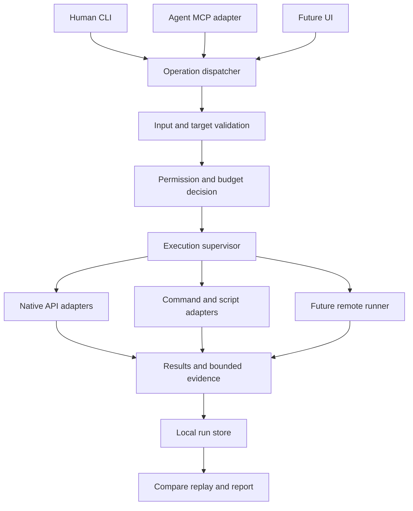

# Architecture specification

The proposed design uses a Rust operations core with thin CLI and MCP entry points. Integrations
implement a shared operation contract. Rust is a product choice to review in DEC-01; no performance
or security benefit is assumed merely from the language.

## Component boundaries



| Component | Owns | Must not own |
|---|---|---|
| Interfaces | Argument parsing, discovery, presentation, transport mapping | Separate authorization or business logic |
| Dispatcher | Operation/version lookup and normalized request | Implicit shell interpretation |
| Context resolver | Provenanced service/target/resource resolution | Credentials, approvals or invented missing inventory |
| Policy evaluator | Effective operation/target/input limits from trusted host configuration | Self-asserted agent identity or plugin grants |
| Supervisor | Deadline, process tree, output bounds, cancellation and event ordering | Automatic replay of uncertain effects |
| Adapters | Specific command/API/task behavior and result validation | Bypassing the policy or persistence interface |
| Run store | Versioned records, artifacts, retention and export | Hidden credential persistence |
| Remote runner | Later authenticated execution on a named host under a named identity | Implicit remote fallback from failed local work |

## Initial implementation structure

Proposed independent repository structure:

```text
crates/workbench-core/     contracts, dispatcher, policy, adapters, run store
crates/workbench-cli/      human CLI and JSON output
crates/workbench-mcp/      MCP adapter calling the same core
spec/                     versioned schemas and compatibility fixtures
tests/contract/           cross-interface and adapter acceptance
tests/platform/           Windows, Linux and macOS execution cases
docs/                     user, integration, extension and operator documentation
```

Start with modules inside the core crate; extract additional crates only for real independent
ownership/build boundaries. Candidate libraries include a CLI parser, serialization/schema support,
an async runtime, HTTP/TLS client and the official Rust MCP SDK. Exact versions, license review,
minimal supported Rust version and feature flags are selected and locked in WP-02; this document
does not prescribe unreviewed dependency pins. No Rust SDK API examples are implementation promises.

Build native Grafana reads behind a compatibility adapter and keep current Python behavior as a
reference corpus. Optional Python/PowerShell/Bash tasks declare their runtime dependencies. Shipping
the Rust binary does not install those interpreters. The product is independently released;
Save Toolkit integration changes remain canonical agent/skill changes with generated projections.

## Request execution sequence

1. Parse the transport request with byte/depth limits; reject unknown control fields.
2. Resolve an installed operation and supported contract version.
3. Resolve explicit target, environment and working directory into a snapshot with source revision.
4. Validate operation-specific inputs and effective limits. Relative time becomes one fixed UTC range.
5. Obtain effective grants from the trusted runtime and intersect them with operation restrictions.
6. Resolve the executable or API destination and bind any required plan to the exact operation.
7. Create the run record, acquire required resources and dispatch through the supervisor.
8. Collect bounded output, apply the operation's output controls, validate structured results and
   attach source/coverage information. Never parse human prose into authoritative findings by regex.
9. Finalize the result and owned artifacts. Deliver the same semantic result through CLI or MCP.
10. On interruption, record observed process state and any unresolved external effect. Stop retries
    until the operation's recovery contract permits them.

Pre-dispatch rejection must cause zero target effects. A persisted local receipt is a declared
local side effect even for operational read requests; `--record never` disables optional evidence
persistence but cannot bypass mandatory change audit requirements.

## Extensibility

Built-in capabilities implement internal Rust interfaces compiled with the product. Independently
distributed extensions run as separate executables using a versioned message protocol. This avoids
relying on a stable native Rust ABI, which the Rust reference does not guarantee [SRC-02](sources.md).
Neither boundary is a sandbox; isolation depends on OS/service identity and enforced resources.

An installed extension supplies a capability manifest, schemas, executable digest and compatibility
range. Discovery loads reviewed metadata without running arbitrary installation hooks. The core
validates manifests, applies host policy, and reports availability and denied reasons. Metadata
describes requested access; it cannot grant it. Execution of a newly installed version is separately
reviewed according to the configured trust policy.

The initial external protocol is JSON Lines on stdin/stdout with stderr reserved for bounded
diagnostics. Messages identify protocol version, request/run ID, sequence number and message kind.
A handshake rejects unsupported versions before work. Events carry progress; exactly one terminal
result ends a request. Unexpected messages, oversized frames, malformed JSON or silent exits fail
the operation. No arbitrary callback/tool invocation from extensions in the first protocol.

Large data uses validated artifact references under a run-owned directory. The host checks relative
paths, symlinks/reparse points, digest and size before exposing them. Cancellation has a grace period
and a hard-stop path. Repeated request IDs do not silently cause replay; persistence and operation
idempotency are separate decisions. No plugin can request a larger budget than the caller received.

The extension acceptance experiment adds a fourth different capability after native API, process
and script adapters. Changes required in unrelated core modules are reviewed as design evidence.
The contract can evolve while draft; published versions use the compatibility rules in contracts.md.

## Storage and artifacts

Use a per-user state directory with restrictive permissions, run metadata and content-addressed
artifacts. Proposed initial storage is SQLite metadata plus ordinary artifact files (DEC-08).
Single-host locking and atomic writes are required; a network-shared SQLite database is unsupported.
An in-memory/no-record route remains for operations that do not require audit persistence.

Runs record request fingerprints, configuration/operation versions, sanitized target identity,
start/end times, ordered events, outcomes and evidence references. Artifact digests establish byte
integrity, not source truth, authorship or trusted execution. A bundle manifest identifies format,
producer version, source observations, artifact sizes/digests, classification and omitted material.
Export produces only the selected sanitized representation; it never copies the entire state store.

Retention is explicit and configurable. Proposed defaults are seven days of retained run evidence
and a one-GiB per-user store cap, subject to DEC-08. Protected audit records require a separately
approved retention policy. Garbage collection removes only owned, unreferenced artifacts; it must
not erase an active run, an unresolved change record or an operator-protected bundle.

## Long work and remote evolution

Initial operations run in the foreground. Progress/cancellation and a durable run ID are designed
early; a job service arrives only with CAP-18. A job handle always identifies the execution location
and owner. Reopening a terminal or reconnecting is not permission to restart the work.

Remote execution is an additional executor with authenticated transport, independent target-side
authorization and a capability handshake. The local core cannot turn a user-supplied role into a
remote identity. Leases, reconciliation and output resumption must be specified before remote
dispatch. Multi-target execution freezes the target set and uses per-target outcomes. Scheduling
adds explicit ownership, timezone, overlap policy and missed-run policy above those primitives.

Live writes require CAP-22 and the current repository's separately controlled effect boundary.
The deferred [EFFECT-001](../fleet-roadmap.md#effect-001--effect-bound-execution-broker) is related
work, not existing infrastructure or blanket authority to implement a broker now.

## Growth without premature commitments

Reserve stable IDs, explicit versions, bounded events, artifact references and interface separation
now. Do not build a plugin marketplace, distributed scheduler, generic workflow language or hosted
control plane before its phase has a concrete consumer and acceptance evidence. These features
remain in scope in the delivery plan. A new feature that cannot fit an operation may justify a
new interface through DEC-12 rather than forcing every future behavior into the original contract.
